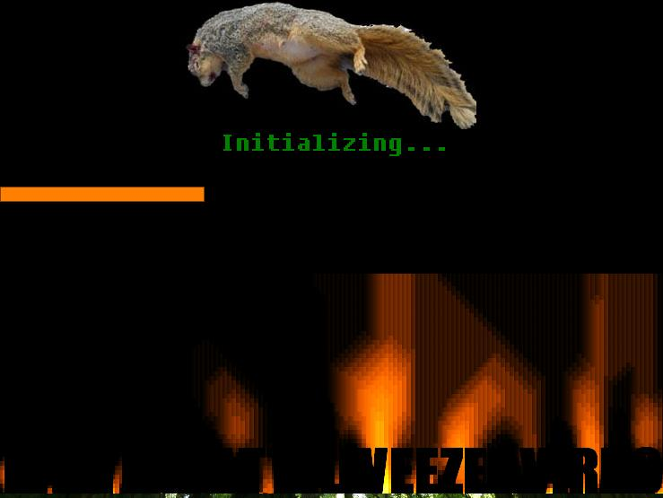



## Baxterdattleweezle virus \(Fake Virus\)

### Description

scare any friends or someone who needs a good scare! The program does not delete any files and does no other harm then disabling task manager and the mouse. Includes a DOS prompt popup The program stays ontop and after a duration of time you recieve a msgbox that enables the task manager and mouse and ends the program restoring everything. Just for fun, to humiliate someone or get a good laugh or reaction, hehe =)
 
### More Info
 
Dirs.txt is the only input i think. which is a directory listing for the baxterdattleweezle virus. The DOS prompt if you want to call it a input but its in its own module.

if you try and use the program full-screen it will have an error if you have a different resolution screen size, i mean the fire will be in the middle of the program insted of where it should be. i hope you undertsand why this program is a window and not full screen, write me if you have a better way, i know i could imorove but its impressive i believe.

no saving a file or anything, no returns.

probabbly many

             |
---                |---
**Submitted On**   |2008-04-25 19:51:54
**By**             |[Oddacon T\. Ripper](https://github.com/Planet-Source-Code/PSCIndex/blob/master/ByAuthor/oddacon-t-ripper.md)
**Level**          |Advanced
**User Rating**    |5.0 (10 globes from 2 users)
**Compatibility**  |VB 6\.0
**Category**       |[Complete Applications](https://github.com/Planet-Source-Code/PSCIndex/blob/master/ByCategory/complete-applications__1-27.md)
**World**          |[Visual Basic](https://github.com/Planet-Source-Code/PSCIndex/blob/master/ByWorld/visual-basic.md)
**Archive File**   |[Baxterdatt2110784252008\.zip](https://github.com/Planet-Source-Code/oddacon-t-ripper-baxterdattleweezle-virus-fake-virus__1-70461/archive/master.zip)

